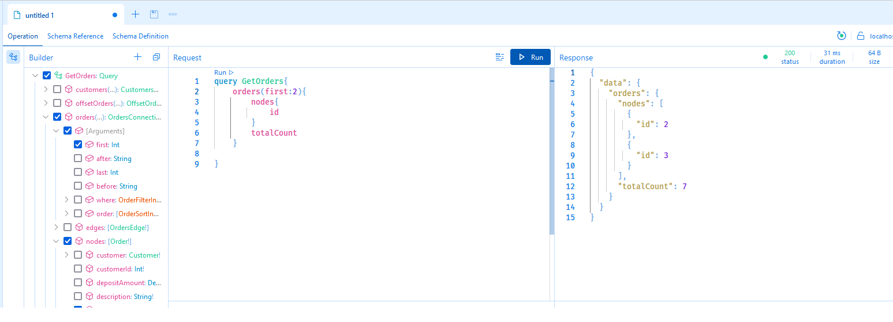
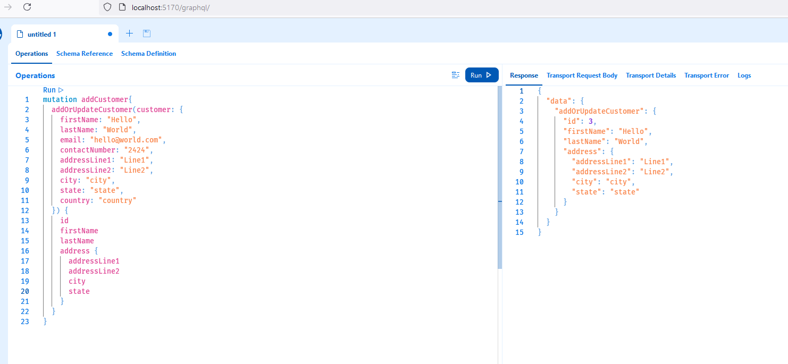
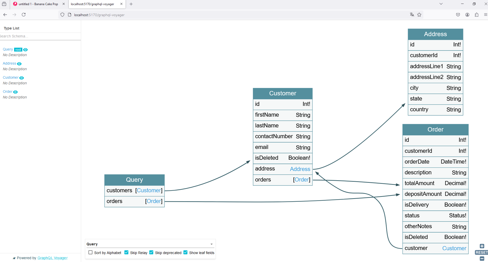
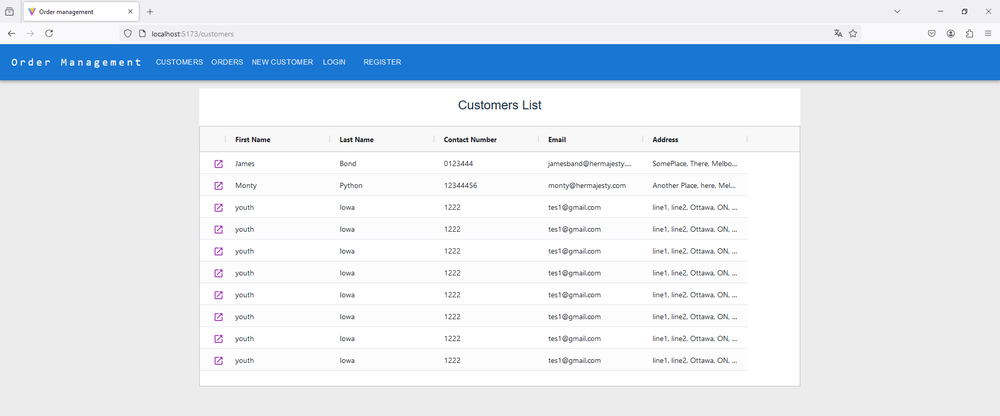
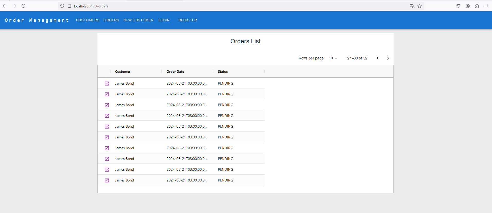
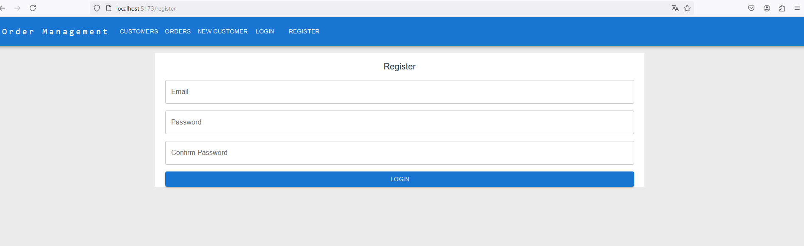
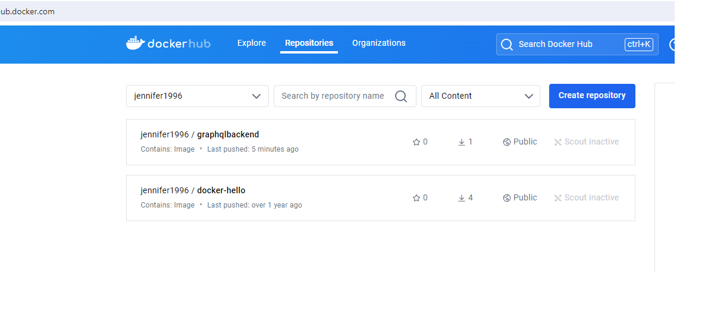

### **Project Overview**

- A **React** project using **TypeScript** with data grid, form validation, and GraphQL integration.
- Backend implemented with **C# Web API**, featuring optimized query handling and authentication.

### **Frontend (React)**

- **[ag-grid-react](https://www.ag-grid.com/react-data-grid/)**: Used for efficient data display and interaction.
- **[GraphQL](https://graphql.org/)**: Used for querying and mutating backend data.
- **[Formik](https://formik.org/)** + **[Yup](https://github.com/jquense/yup)**: Handling form state management and validation.

### **Backend (C# Web API)**

- **Optimized Query Handling**:
  - Implemented **projected queries** to return only necessary fields, reducing network traffic.
- **GraphQL Authorization**:
  - Added **authentication and authorization** mechanisms for GraphQL API access.

### set up frontend

```bash
 yarn
```

### set up backend

```bash
dotnet restore
```

### **Deployment**

- **Dockerized Deployment**: The project is containerized using **Docker**.
- **CI/CD Pipeline**: Implemented **CI/CD** on **Azure DevOps** for automated builds and deployments.

### **Screenshots**

1. **GraphQL Query Execution** – 
2. **GraphQL Mutation Execution** – 
3. **Database schema** – 
4. **React Data Representation** – 
5. **React Data Pagniation** - 
6. **React Login** - 
7. **Docker image** - 
